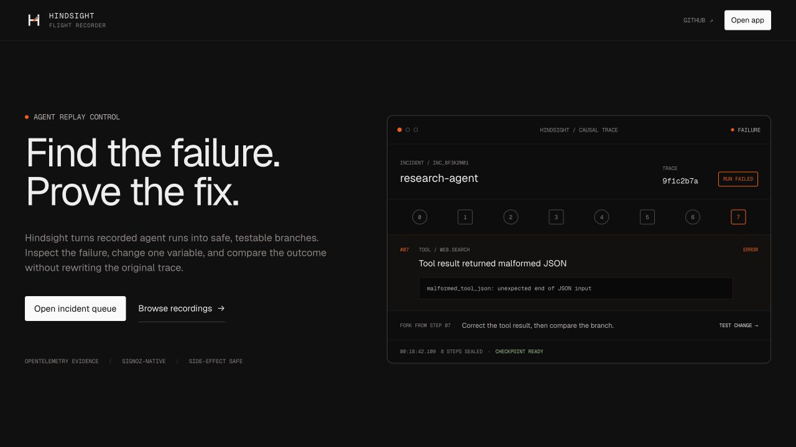
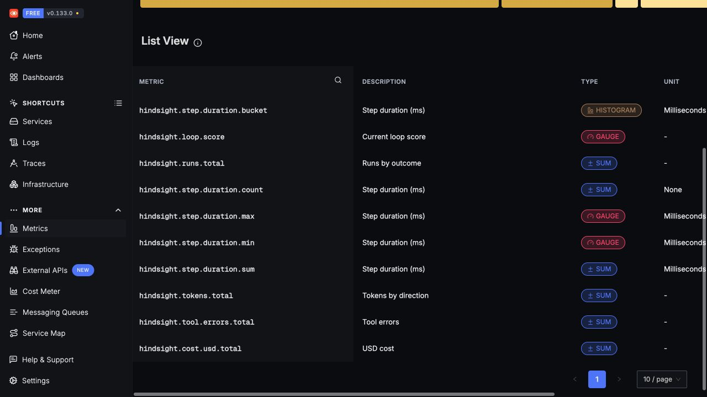
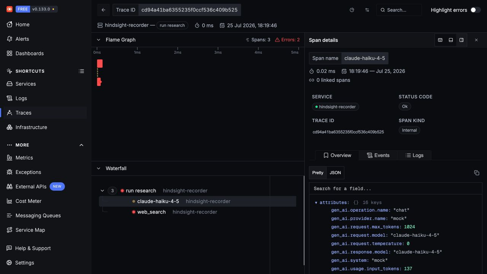
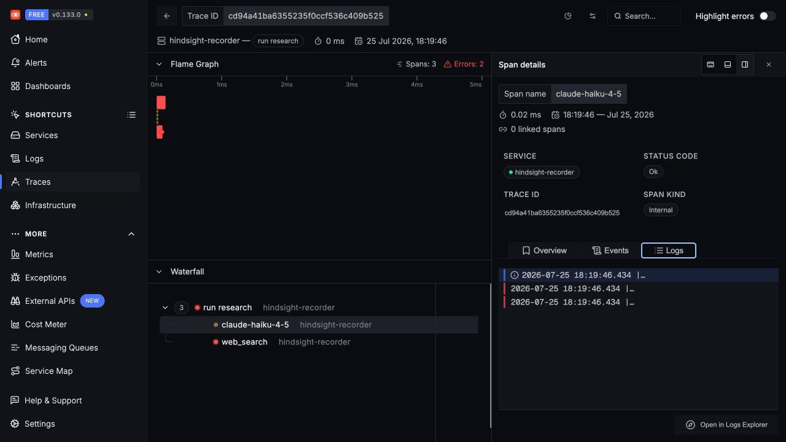

# Hindsight

**A flight recorder for AI agents.** Record a run, replay its captured evidence
without live calls, and fork a complete checkpoint through the agent's
registered runtime — with [SigNoz](https://signoz.io) as the system of record.



---

## The problem: traces are autopsies

When an agent misbehaves, the usual observability stack tells you *that* it failed and roughly *where* — after the fact, on a corpse. A trace is an autopsy: read-only, past-tense, and missing the one thing you actually want, which is to change one input and see what *would have* happened.

Agents make this worse. They loop. They burn tokens. They call the wrong tool, then apologize, then call it again. The failure is rarely a single bad span — it's a *path*, and you can't re-walk the path from a flat trace.

Hindsight turns the autopsy into a time machine: the same telemetry that records the run also lets you **re-run it, and branch it.**

---

## Three verbs: Record · Replay · Fork

- **Record** — Agents emit versioned OpenTelemetry spans, correlated payload and
  event logs, and fleet metrics. Payload capture can be `off`, `redacted`, or
  `full`; byte limits, hashes, and completeness are recorded explicitly.
- **Replay** — The engine traverses recorded responses only. It performs zero
  provider or tool calls and rejects an incomplete, redacted, truncated, or
  tampered checkpoint.
- **Fork** — A configured runner reconstructs state before the branch, applies
  exactly one supported mutation, then runs the real agent loop. Recorded tools
  are matched by name, normalized arguments, and occurrence. Side-effecting
  tools never run live.

---

## Architecture

```
  demo-agents ──emit OTLP──▶  SigNoz (localhost:8080)  ◀── dashboards + alerts (infra/)
   (recorder)                  traces · logs · metrics          │
                                       ▲                         │ webhook
                                       │ query_range             ▼
                                  replay-engine (:4123) ──── /hooks/signoz
                                       ▲      │             incidents · evidence
                                       │ REST │ runner protocol
                                    studio    ▼
                                    (:5173)  agent runner (:4124)
```

### SigNoz as the system of record — pillar map

SigNoz holds run evidence. The replay-engine's SQLite database holds only
operational state: incidents, alert deduplication, fork attempts, verification,
and measured resolution time.

| Concern                     | SigNoz pillar | How Hindsight uses it                                                        |
| --------------------------- | ------------- | --------------------------------------------------------------------------- |
| Run structure / step graph  | **Traces**    | Spans carry `hindsight.run.id`, `hindsight.agent.id`, step index/kind, hashes |
| Full payloads (msgs, I/O)   | **Logs**      | Payload log records correlated by `trace_id`/`span_id` (`hindsight.payload`)  |
| Fleet health / SLOs / cost  | **Metrics**   | `hindsight.runs.total`, `hindsight.step.duration`, `hindsight.loop.score`, `hindsight.cost.usd.total` |
| Detection → action          | **Alerts**    | Trace-correlated log rules POST authenticated webhooks to the engine          |

---

## Quickstart

SigNoz must already be running at `http://localhost:8080`. Create a SigNoz API
key, choose a webhook bearer secret, then copy and fill the local environment:

```bash
cp .env.example .env
# Set SIGNOZ_API_KEY and SIGNOZ_WEBHOOK_SECRET in .env.
make doctor
make demo
```

`make doctor` verifies Node, pnpm, the Foundry files, SigNoz v0.133.x, OTLP
ingestion, and both required credentials. `make demo` builds the workspace,
waits for the reference runner (`:4124`), replay-engine (`:4123`), Studio
(`:5173`), and Taskline (`:4174`) to become healthy, then records mixed demo
runs.

An incident appears only when an installed trace-correlated SigNoz rule
delivers an authenticated webhook. Hindsight never inserts a fake incident in
the main demo path.

The JSON under `infra/` is versioned configuration, not proof of installation.
Every file starts as `template_uninstalled`; confirm imported resources through
the SigNoz API:

- **Dashboards** — SigNoz UI → Dashboards → *Import JSON* → `infra/dashboards/agent-reliability.json` and `infra/dashboards/hindsight-ops.json`.
- **Run incident alerts** — create a webhook channel named
  `hindsight-replay-engine` for
  `http://host.docker.internal:4123/hooks/signoz` when SigNoz runs in Docker
  (`http://localhost:4123/hooks/signoz` otherwise). Leave the username empty,
  use `SIGNOZ_WEBHOOK_SECRET` as the password, then submit
  `infra/alerts/run-failures.json` and `loop-tripwire.json` to SigNoz
  `POST /api/v2/rules`.
- **Fleet notifications** — `cost-spike.json` and `latency-drift.json` have no
  Hindsight incident channel because an aggregate metric has no authoritative
  trace ID.

Other targets: `make up` (start stack), `make seed` (demo data), `make dev`
(watch mode), `make down` (stop app processes; SigNoz untouched).

### Live SigNoz evidence

The repository's demo recorder has been verified against SigNoz EE v0.133.0.
The captures below show real OTLP data, not fixture UI.







`pnpm build`, all 53 unit tests, and `pnpm validate:infra` pass on the submitted
revision.

### Taskline: AI to-do agent demo

`make up` also starts Taskline at `http://localhost:4174`. A normal request
records the agent's `list_tasks` and `create_task` calls. The failure example
uses an invalid priority, opens a Hindsight incident, and links directly to the
failed tool step so you can fork it with an overridden result.

`make up` runs Taskline through local `gemma3:1b`; Ollama's local API needs no
key. Taskline uses a JSON action protocol because Gemma 3 1B does not expose
native tool calls. Set `HINDSIGHT_TODO_PROVIDER=offline` for the deterministic
fallback, or use `anthropic` plus `ANTHROPIC_API_KEY`.

To record against the real provider path instead of the explicit offline mock:

```bash
ANTHROPIC_API_KEY='...' HINDSIGHT_DEMO_PROVIDER=anthropic \
  pnpm --filter @hindsight/demo-agents demo
```

---

## Fork walkthrough

1. The recorder detects a loop or failed run and emits a trace-correlated
   `loop_detected` or `run_failed` log event.
2. SigNoz POSTs to `/hooks/signoz`; the replay-engine opens an **incident** anchored to the run's trace id.
3. Open the incident in Studio. The run view reports checkpoint completeness,
   agent revision, runner availability, and supported mutations.
4. Fork with one mutation. The registered runtime confirms the revision and
   mutation hash and emits a span-linked trace carrying the incident ID.
5. Hindsight queries the new trace and resolves only if the original failed,
   the linked fork succeeded, the original failure/event is absent, and all
   lineage and mutation evidence matches. Otherwise the incident returns open.

The exact three-minute recording path is in
[`docs/submission/demo-script.md`](docs/submission/demo-script.md).

---

## Design decisions

- **Payload-as-logs.** Span attributes have practical size limits, so full LLM messages and tool I/O are written as OTel *log records* correlated by `trace_id`/`span_id`. Spans stay cheap and queryable; payloads stay complete. See `packages/shared/src/telemetry.ts` and `apps/replay-engine/src/signoz/client.ts`.
- **Replay and fork are distinct.** Replay is data-only. Forking calls a
  configured runtime; strict mode rejects an unrecorded tool dependency, while
  hybrid mode may run only tools the runner declares safe.
- **Span links for lineage.** Forks reference their origin via `hindsight.fork.of` / `hindsight.fork.point`, so a forked run is traceable back to the incident and the exact step it branched from.
- **Proof before resolution.** Manual updates can dismiss with a reason, but
  cannot set `verifying` or `resolved`. Alert recovery also cannot resolve an
  incident.
- **Config-as-code.** Dashboard and alert templates target SigNoz v0.133.x.
  `pnpm validate:infra` checks their `hindsight.*` names against the shared
  telemetry contract. Templates remain uninstalled until SigNoz confirms them.

---

## Limitations & non-goals

- **Not a SigNoz replacement or installer.** Hindsight assumes a running SigNoz (managed under `pours/deployment/`); it does not stand one up.
- **Replay and fork require complete evidence.** Missing, redacted, truncated,
  mismatched, or expired payload logs fail closed; they never fall through to
  live execution.
- **Provisioned JSON is version-specific.** The `infra/` config targets SigNoz EE ~v0.133.0. On other versions, validate on import (each file carries a note).
- **Payload retention matters.** Payload logs must be retained at least as long
  as the traces operators expect to replay or fork. Full capture may contain
  sensitive data and increases log storage; redacted capture is safer but may
  intentionally make a checkpoint non-forkable.
- **Only registered revisions can fork.** Configure agent ID → runner URL and
  revision with `HINDSIGHT_RUNNERS`. The engine never accepts a callback URL
  from the browser.
- **Not a general agent framework or eval harness.** Hindsight records, replays, and forks runs; it does not orchestrate agents or score model quality.
- **Local-first.** The default endpoints and the `make demo` flow assume a single-host dev setup.

---

## License

[MIT](./LICENSE) © 2026 Hindsight.

## AI assistance disclosure

AI coding assistants were used during implementation, testing, design review,
and documentation. Architecture, product decisions, integration verification,
and the submitted result were reviewed and owned by the project author.
